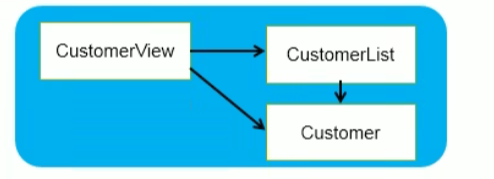

# JavaSE学习阶段MVC设计模式小练习

模块的组成：

- CustomerView为主模块，负责菜单的现实和处理用户操作
- CustomerList为Customer对象的管理模块，内部用数组管理一组Customer对象。提供添加 、修改、删除、遍历方法，供CustomerView调用
- Customer为实体对象，用来封装客户信息

>该练习的数据均保存以Data类的静态属性保存在内存中，不涉及到MySql等数据库。主要用于在JavaSE的学习过程中，体会MVC设计模式，以及体会如何定义并使用枚举类、自定义异常类。

